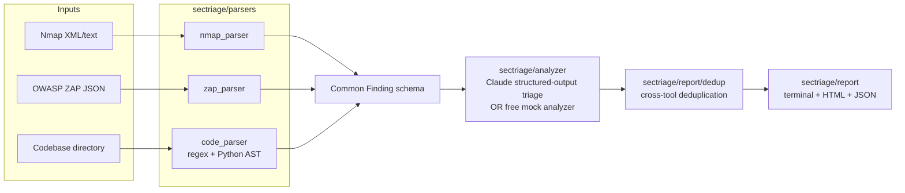

# SecTriage

An LLM-powered security vulnerability triage agent. SecTriage ingests raw output from
common security scanners (Nmap, OWASP ZAP) and/or a local codebase, normalizes every
finding into a common schema, uses Claude to classify, explain, and prioritize each one
against the OWASP Top 10 (2021), deduplicates findings that point at the same root
cause across tools, and produces a human-readable HTML report plus a machine-readable
JSON export and a terminal summary table.

```
sectriage scan --nmap results.xml --zap zap-report.json --code ./repo
```

## Why this exists

Security teams routinely drown in raw scanner output: hundreds of Nmap/ZAP findings
with no business context, plus whatever a static analyzer flags in the codebase — none
of it prioritized, none of it deduplicated, and none of it explained in a way a
non-specialist stakeholder can act on. SecTriage's job is to turn that raw pile into a
short, prioritized, actionable list.

## Architecture



Every parser emits the same normalized shape:

```python
Finding(source_tool, severity, description, affected_asset, raw_evidence, ...)
```

The analyzer enriches each `Finding` with a `TriageResult` (OWASP category,
plain-language explanation, exploitability assessment, business impact, remediation
step, and a combined priority) using the Claude API's **structured outputs**
(`output_config.format` with a JSON schema) rather than prompting and parsing free
text — the response is guaranteed to validate against the schema. The shared system
prompt (OWASP category rubric + triage instructions) carries a `cache_control`
breakpoint so repeated calls across many findings in one run reuse the cached prefix
instead of reprocessing it at full price (see [Caching](#caching-and-cost) below).

## Setup

```bash
pip install -r requirements.txt
# or, to get the `sectriage` command on your PATH:
pip install -e .
```

Requires Python 3.10+. The only dependency is the `anthropic` SDK, and it's only
*imported* if you actually run with `--live` — the default mock mode needs nothing
beyond the standard library.

> `pip install -e .` may install the `sectriage` script to a user Scripts directory
> that isn't on your `PATH` yet (pip will warn if so). If `sectriage` isn't found,
> use `python -m sectriage.cli scan ...` instead — it works identically without
> needing the script on `PATH`.

## Usage

```bash
# Free, zero-cost mode (default) — deterministic mock analyzer, no API key needed
sectriage scan --nmap results.xml --zap zap-report.json --code ./my-repo

# Real Claude API triage (requires ANTHROPIC_API_KEY)
export ANTHROPIC_API_KEY=sk-ant-...
sectriage scan --code ./my-repo --live

# Treat every finding as internet-facing for exploitability/priority scoring
sectriage scan --code ./my-repo --internet-facing

# Any subset of inputs works — code review alone, or scan outputs alone
sectriage scan --code ./my-repo
```

Every run prints a terminal summary table and writes `report.json` +
`report.html` to `--out-dir` (default `./sectriage-report`).

### Mock mode vs. `--live`

There is no free tier for the Claude **API** itself (only claude.ai's chat UI is
free) — it's pay-per-token. So SecTriage defaults to a deterministic **mock
analyzer** that reproduces the same OWASP-mapping / prioritization logic using the
vuln-pattern taxonomy the code scanner already assigns, with zero network calls and
zero cost. This lets you exercise the entire pipeline — parsing, triage, dedup,
report rendering — for free, and is what the bundled test suite runs against.

Pass `--live` (with `ANTHROPIC_API_KEY` set) to get real Claude-generated
explanations, exploitability assessments, and remediation text. Default live model
is `claude-haiku-4-5` — the cheapest current model, which is more than sufficient
for a bounded classification-and-remediation task like this one. Override with
`--model`.

### Caching and cost

The system prompt (OWASP rubric + triage instructions) is identical for every
finding in a run, so it's sent with `cache_control: {"type": "ephemeral"}`. On
Claude Opus/Sonnet the cacheable minimum is small enough that this reliably kicks in
even for a modest prompt; on Haiku 4.5 the minimum is 4096 tokens, so caching may not
engage on a short prompt — the breakpoint is harmless to leave in either way, and
pays off if you extend the system prompt (e.g. with organization-specific triage
guidance) past that threshold.

## Static code review: supported patterns

The code scanner (`sectriage/parsers/code_parser.py`) supports **Python,
JavaScript/TypeScript, Java, and Go**. It's a **line-based pattern scanner plus a
small Python AST pass** for a few high-confidence dangerous calls (`eval`, `exec`,
`os.system`, `marshal.loads`) — not a full data-flow/taint analyzer. It flags:

- SQL injection (string-built queries instead of parameterized ones)
- Cross-site scripting (unescaped HTML output, `innerHTML`, `document.write`)
- Hardcoded secrets (API keys, AWS access keys, private key blocks)
- Insecure deserialization (`pickle`, unsafe `yaml.load`, `eval`)
- Missing auth checks (heuristic: sensitive-sounding Flask route with no auth
  decorator nearby — always flagged as needing manual confirmation)
- SSRF (outbound requests built from unvalidated user input)
- Path traversal (file paths built from unsanitized user input)

Every finding cites the exact `file:line`. **Known limitation:** because matching is
line-based, a vulnerability built across multiple lines (e.g. a query string
assembled on one line and executed on the next) can be missed, and conversely a
value that was validated a few lines above a sink can still be flagged, since the
scanner has no data-flow analysis to see the check. Both failure modes are
demonstrated deliberately in the test fixture — see
[Testing & accuracy evaluation](#testing--accuracy-evaluation).

## Deduplication

Findings from different tools sometimes point at the same underlying issue — e.g.
Nmap flagging an outdated TLS service and ZAP flagging a weak-cipher alert on the
same host. `sectriage/report/dedup.py` groups findings by (normalized asset, OWASP
category) after triage and marks all but the highest-priority one in each group as a
duplicate. This is a heuristic, not semantic matching — see the module docstring for
the tradeoffs.

## Testing & accuracy evaluation

```bash
# Unit tests (parsers, dedup, mock analyzer) — pure stdlib, no network
python -m unittest discover -s tests -t .

# Accuracy + timing evaluation against the bundled vulnerable Flask+JS fixture app
python tests/run_eval.py            # mock mode, $0 cost
python tests/run_eval.py --live     # real Claude API — writes real latency/token numbers
```

`tests/run_eval.py` regenerates **[results.md](results.md)** at the project root:
static-scanner precision/recall/F1 against a hand-authored ground-truth manifest
(`tests/fixtures/vulnerable_app/ground_truth.json`), plus end-to-end pipeline
throughput. The fixture app (`tests/fixtures/vulnerable_app/`) is a minimal,
deliberately vulnerable Flask + JS app written for this project specifically so the
ground truth is exact and reproducible — see results.md's methodology section for
what that does and doesn't prove, including two intentionally-included cases
(a missed multi-line SQL injection, and a false-positive-flagged pre-validated URL)
that keep the reported accuracy honest rather than artificially perfect.

## Project layout

```
sectriage/
  models.py            Finding / TriageResult / TriagedFinding schema
  cli.py                `sectriage scan ...` entry point
  parsers/
    nmap_parser.py      Nmap XML (and plain-text) -> Finding
    zap_parser.py        ZAP JSON report -> Finding
    code_parser.py       Static pattern scanner -> Finding
  analyzer/
    schemas.py            OWASP categories + structured-output JSON schema
    llm_client.py         Claude API call (structured outputs + prompt caching)
    mock.py                Free deterministic stand-in for the LLM call
    triage.py              Orchestrates per-finding triage + run metrics
  report/
    dedup.py               Cross-tool deduplication
    terminal_report.py      Plain-text summary table
    html_report.py          Self-contained HTML report
    json_report.py          Machine-readable JSON export
tests/
  fixtures/                Nmap/ZAP sample files + the vulnerable_app fixture
  run_eval.py              Accuracy/timing evaluation -> results.md
  test_*.py                 Unit tests
```

Adding a new scanner input type means writing one new parser module that returns a
`list[Finding]` — nothing else in the pipeline needs to change.
